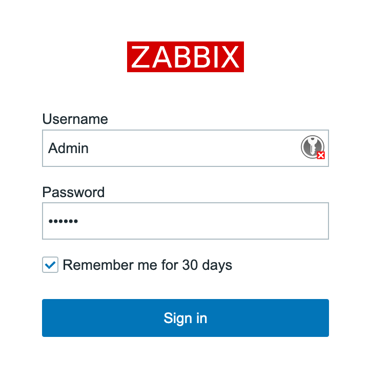
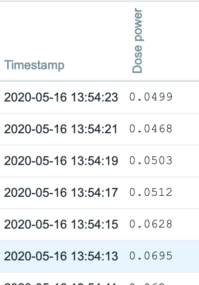
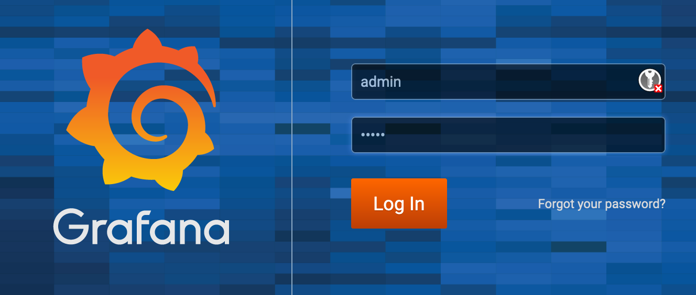
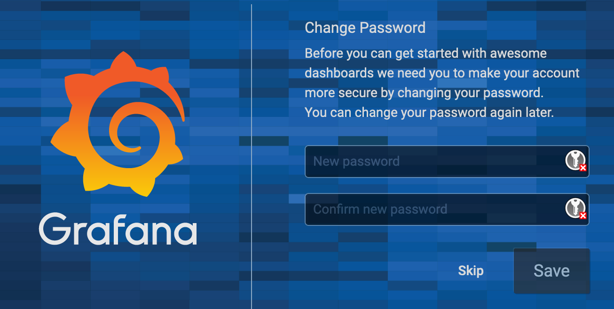
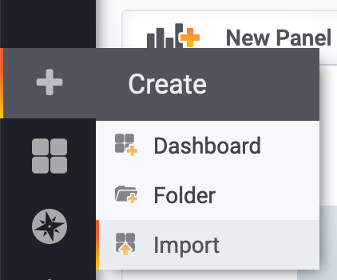
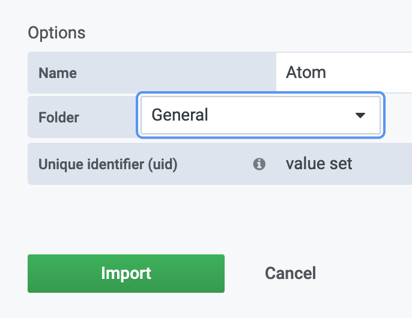
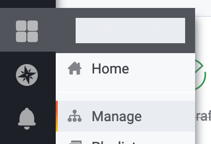
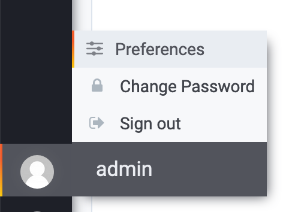
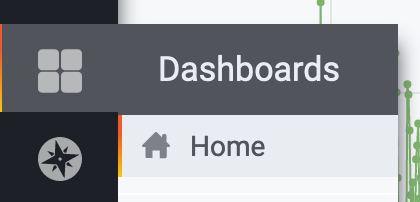
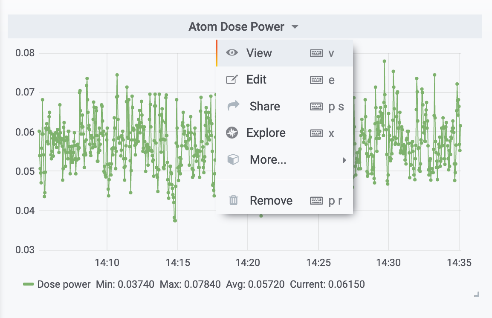

# atom-fast-rpi
Сборщик показаний для дозиметров Atom Fast компании (КБ Радар)[https://kbradar.org/] на базе Raspberry Pi

Работа системы проверялась на RPi 3B+ и RPi 4 совместно с дозиметром Atom Fast 8850. Возможно будет работать на любом одноплатнике с поддержкой протокола Bluetooth LE.

# Основные возможности

* Показания собираются и хранятся в базе
* Доступ к показаниям возможен через локальный сервер мониторинга Zabbix (графики и таблицы), или через Grafana (только графики)
* Можно отправлять показания на удаленный Zabbix сервер
* При подключении к Raspberry модуля расширения PiFace CAD на его экране отображается текущая мощность дозы и накопленная доза в мкЗв/ч и мкЗв

# Установка

Проверено на образе Raspbian Buster (версия 2020 года). Предполагается, что на Raspberry уже настроено подключение к сети (WiFi или GSM модем). Все действия выполняются от стандартного пользователя pi - либо из локального терминала, либо из SSH-сессии.

# Установка Git и получение копии этого репозитория

```
sudo apt-get update && sudo apt-get -y install git
cd ~
git clone https://github.com/p1ne/atom-fast-rpi.git
```

# Раздача прав на Bluetooth пользователю pi

Скопировать файл etc/dbus-1/system.d/bluetooth.conf из этого репозитория поверх системного и перезапустить сервис bluetooth

```
sudo cp etc/dbus-1/system.d/bluetooth.conf /etc/dbus-1/system.d
sudo systemctl restart bluetooth
```

# Установка Docker

```
sudo apt-get update && sudo apt-get -y upgrade
curl -fsSL https://get.docker.com -o get-docker.sh
sudo sh get-docker.sh
sudo usermod -aG docker pi
```

после установки Docker нужно перелогиниться

# Сборка контейнера с atom-fast-rpi из исходников

```
cd ~/atom-fast-rpi
docker build -t atom-fast -f Dockerfile . 2>&1 | tee log
```

Успешно собранный контейнер должен появиться в списке команды  ```docker images```


# Запуск контейнеров

## Запуск Zabbix

Если планируется использовать удаленный сервер Zabbix - этот пункт не нужен

```
docker run --name zabbix-appliance -t       -p 10051:10051       -p 80:80       --restart unless-stopped       -d zabbixmultiarch/zabbix-zabbix-appliance-alpine:latest
```

## Запуск Grafana

Если планируется использовать удаленный сервер Grafana - этот пункт не нужен

```
docker run --name atom-grafana -e "GF_INSTALL_PLUGINS=alexanderzobnin-zabbix-app" -t -p 3000:3000 --network="host" --restart unless-stopped -d grafana/grafana:latest
```

## Запуск Atom Fast RPi

- Для запуска нужно знать MAC-адрес дозиметра и указать его в параметре BT_MAC
- Если предполагается использовать PiFace CAD, то параметр PIFACE=yes
- Если предполагается использовать удаленный сервер Zabbix - указать его хост и порт в параметрах ZABBIX_HOST/ZABBIX_PORT
- Параметры METRIC_HOST/METRIC_NAME можно оставить как есть, но если на удаленном сервере Zabbix собираются показания нескольких дозиметров с нескольких Raspberry Pi, то для каждого заводится отдельная метрика, которая указывается в METRIC_NAME.

```
docker run -t --name atom-running --privileged -v /dev/bus/usb:/dev/bus/usb -v /run/dbus:/run/dbus -v /var/run/dbus:/var/run/dbus --cap-add=ALL -e BT_MAC=xx:xx:xx:xx:xx:xx -e ZABBIX_HOST=localhost -e ZABBIX_PORT=10051 -e METRIC_HOST=atom -e METRIC_NAME=atom.dose_power -e PIFACE=no --network="host" --restart unless-stopped -d atom-fast:latest
```

Успешно запущенные контейнеры должны появиться в списке команды ```docker ps```


# Настройка Zabbix

- Скачать на компьютер файл zbx_export_hosts.xml из этого репозитория
- Перейти по адресу [http://raspberrypi.local](http://raspberrypi.local)
- Войти с учетной записью Admin/zabbix



- Выбрать пункт Configuration/Hosts


- Нажать кнопку Import


- Выбрать файл zbx_export_hosts.xml с компьютера и нажать кнопку Import внизу


- Успешный импорт настроек подтверждается так


- Для просмотра значений мощности дозы необходимо перейти в пункт Monitoring/Graphs


- Там выбрать group = atom, Host = Atom, Graph = Dose_power


- внизу будет отражаться график мощности дозы. Период просмотра можно выбирать, задавая интервалы над графиком


- Для просмотра числовых значений вместо View as = Graph, нужно выбрать View as = Values


- Значения будут выгляеть так



# Настройка Grafana

- Скачать на компьютер файл grafana-atom.json из этого репозитория
- Перейти по адресу [http://raspberrypi.local:3000](http://raspberrypi.local:3000)

- Войти с учетной записью admin/admin



- При желании сменить пароль или нажать Skip


- Нажать на иконку + слева, выбрать Import



- Нажать "Upload .json file" и загрузить файл grafana-atom.json


- Выбрать папку General и нажать кнопку Import



- Нажать на иконку с квадратами слева, выбрать Manage



- Поставить звездочку панели Atom


- Нажать на иконку профиля слева внизу, выбрать Preferences



- Выбрать Atom в качестве Home dashboard, нажать Save


- Нажать на иконку с квадратами слева, выбрать Home



- Чтобы развернуть график мощности дозы на весь экран - выбрать пункт View



# Просмотр данных после настройки

## В Zabbix
- Перейти по адресу [http://raspberrypi.local](http://raspberrypi.local)
- Войти с учетной записью Admin/zabbix
- Перейти в пункт Monitoring/Graphs

## В Grafana

- Перейти по адресу [http://raspberrypi.local:3000](http://raspberrypi.local:3000)
- Войти с учетной записью admin/admin (или другой пароль, если меняли)